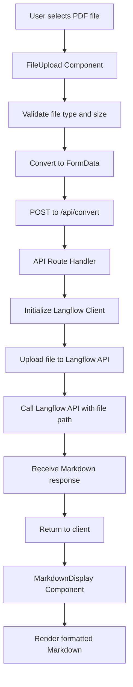

# PDF to Markdown Converter - Architecture Plan

## Overview
A Next.js application that converts PDF files to Markdown using the Langflow API via the [@datastax/langflow-client package](www.npmjs.com/package/@datastax/langflow-client).

## Technology Stack
- **Framework**: Next.js 16.0.3 (App Router)
- **Language**: TypeScript 5
- **Styling**: Tailwind CSS v4
- **API Client**: [@datastax/langflow-client](www.npmjs.com/package/@datastax/langflow-client)
- **Runtime**: Node.js 20+

## Application Architecture

### Component Structure

```
app/
├── api/
│   └── convert/
│       └── route.ts          # API endpoint for PDF conversion
├── components/
│   ├── FileUpload.tsx        # PDF upload component with drag-and-drop
│   └── MarkdownDisplay.tsx   # Markdown output display component
├── layout.tsx                # Root layout with metadata
└── page.tsx                  # Main page integrating components
```

### Data Flow



## Environment Variables

Required environment variables in `.env.local`:

```
LANGFLOW_BASE_URL=https://your-langflow-instance.com
LANGFLOW_API_TOKEN=your-api-token-here
LANGFLOW_FLOW_ID=your-flow-id-here
LANGFLOW_FILE_COMPONENT_NAME=file-component-id-here
```

## Component Details

### 1. FileUpload Component
**Purpose**: Handle PDF file selection and upload

**Features**:
- Drag-and-drop interface
- File type validation (PDF only)
- File size limit (e.g., 10MB)
- Visual feedback during upload
- Error handling for invalid files

**State Management**:
- `file`: Selected PDF file
- `mode`: Pipeline mode ('default' or 'vlm')
- `isUploading`: Loading state
- `error`: Error messages

### 2. MarkdownDisplay Component
**Purpose**: Display converted Markdown content

**Features**:
- Markdown rendering
- Copy to clipboard functionality
- Download as .md file option
- Responsive design

### 3. API Route (/api/convert)
**Purpose**: Handle PDF conversion via Langflow

**Process**:
1. Receive PDF file from client
2. Validate file format and size
3. Initialize Langflow client with credentials
4. Send PDF to Langflow API
5. Send file path and pipeline mode as tweaks to flow
6. Process response and extract Markdown
7. Return Markdown to client
8. Handle errors appropriately

**Request Format**:
```typescript
POST /api/convert
Content-Type: multipart/form-data
Body: { file: PDF file, mode: "standard" | "vlm" }
```

**Response Format**:
```typescript
{
  success: boolean;
  markdown?: string;
  error?: string;
}
```

## Langflow Integration

### Client Initialization
```typescript
import { LangflowClient } from '@datastax/langflow-client';

const client = new LangflowClient({
  baseUrl: process.env.LANGFLOW_BASE_URL,
  apiKey: process.env.LANGFLOW_API_TOKEN
});
```

### Reference to flow
```typescript 
const flow = client.flow(process.env.LANGFLOW_FLOW_ID!);
```

### API Call Pattern

#### Upload the file
```typescript
const uploadResponse = await client.files.upload(file);
```

#### Call the flow, tweak the file component with the file path
```typescript
const response = await flow
   .tweak(fileComponentName, { path: uploadResponse.path })
   .run('');
```

## Error Handling Strategy

### Client-Side Errors
- Invalid file type
- File too large
- Network errors
- Display user-friendly error messages

### Server-Side Errors
- Langflow API failures
- Invalid credentials
- Timeout errors
- Return structured error responses

## UI/UX Design

### Layout
- Clean, centered single-page interface
- Clear call-to-action for file upload
- Progress indicators during conversion
- Side-by-side or stacked view for input/output

### States
1. **Initial**: Upload prompt with drag-and-drop zone
2. **Uploading**: Loading spinner with progress
3. **Success**: Display Markdown output with actions
4. **Error**: Clear error message with retry option
